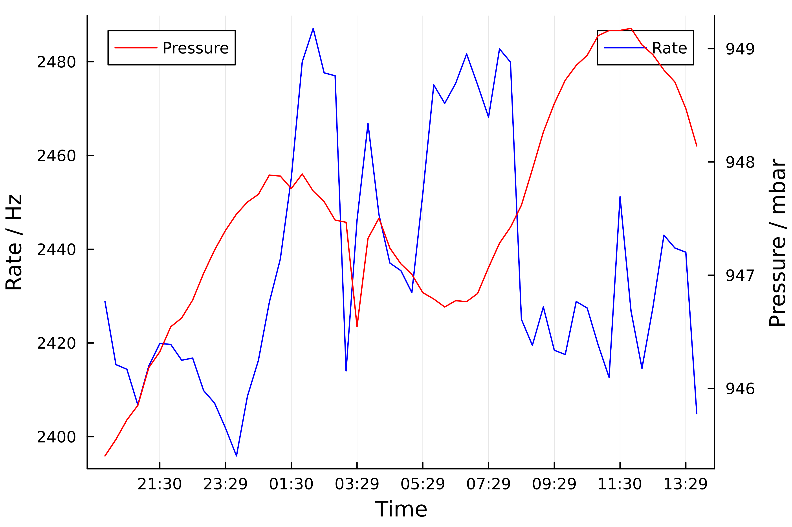
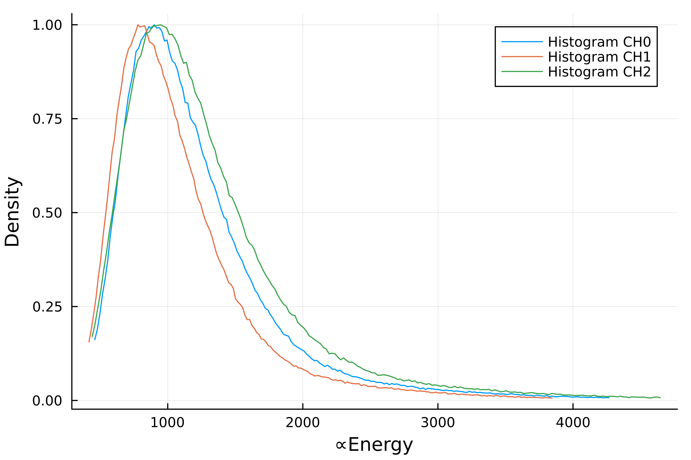

# TancaAnalysis.jl
Julia package to analyze the data recorded with the TancaDataAcquisition package

## Description

This project is the extension to the TancaDataAcquisition project. It is a package wirtten in julia, offering two functions to analyse the data recorded with the TancaDataAcquisition program.

## Get the Arduino Data

The function `readData(workingDir::String, parts::Int)` returns two StructArrays with data mainly recorded with the Arduino Uno:

```
readData(workingDir::String, parts::Int)

Reads all the root Data created by the TancaDataAcquisition program from one woking directory.

# Arguments:
- `workingDir::String`: folder of all root-Files
- `parts::Int`: Number of Parts each hour is devided in for mean values

# Output:
- `StructArrays(containerData2)`
- `StructArrays(containerData3)`

# Structure:
struct Data2\n
\t time::Int
\t pAtm::Float64
\t rate::Float64 \n
end


struct Data3 \n
\t time::Int
\t t1::Float64
\t t2::Float64
\t t3::Float64
\t t4::Float64
\t h1::Float64
\t h2::Float64
\t h3::Float64
\t h4::Float64 \n
end
```

### Usage example

```
using TancaAnalysis, Plots, Dates

# get the Arduino Data Trees
data2, data3 = getArduinoData("testdata/", 3)

# format data
time  = DateTime(1970, 1, 1) .+ Millisecond.(div.(data2.time, 10^6))
time_str = Dates.format.(time, "HH:MM")

rate  = data2.rate
pAtm  = data2.pAtm

# plot rate on the left y axis
plot(time_str, rate, color=:blue, label="Rate", ylabel="Rate", dpi=600)

# plot pressure on the right y axis
plot!(twinx(), time_str, pAtm, color=:red, label="pAtm", ylabel="pAtm (atm)")

savefig("RatePressure.png")
```

#### Output



## Get the spectrum

The function `getHistogram(workingDir::String, bins::Int)` returns a list of Histograms of the Area under the mesured peaks for eeach hour:

```
getSpectrum(workingDir::String)

Returns List of Spectrums, one for every hour.

# Arguments:
- `workingDir::String`: folder of all root-Files
- `bins::Int`: Number of bins for the Spectrum

# Output:
- `Array(Histogram)`
```

### Usage example

```
using TancaAnalysis, Plots

# get the list of histograms
Hist = getHistogram("testdata/", 10000)

# plot one example histogram
plot(Hist[1][1200:1500], label="Histogram", xlabel="∝Energy", ylabel="Density", dpi=600)

savefig("Histogram.png")
```

#### Output

